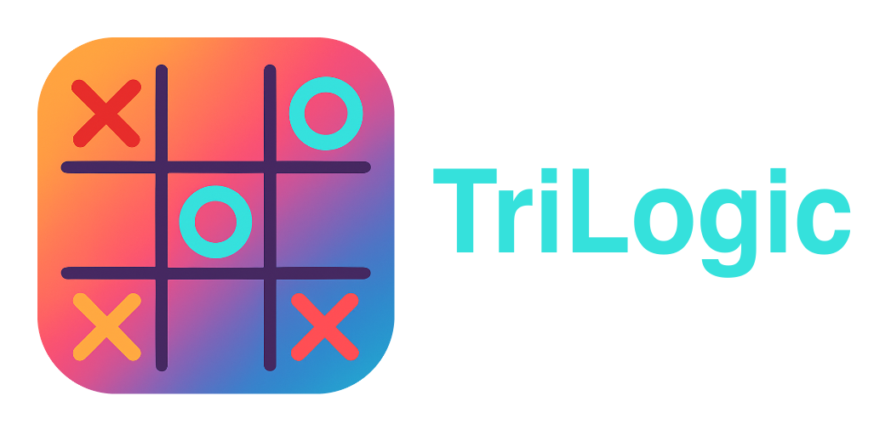

> TriLogic is a simple game of tic-tac-toe.

[](#)
[](#)


 

## About the project

TriLogic is a tic-tac-toe game in which you need to make your move in a specific cell and build your combination so that your opponent cannot block your path to victory. 

There are three modes in this game:

- One-on-one game  
- Gratis against the bot 
- Playing against Artificial Intelligence 

---

## Functionality

Key features:

You can customize the field for convenience

Change field size

Set the color of the field and field grid


## How to assemble the project:

### Prerequisites

- **C++ compiler** (e.g., `g++`, `clang++`)
- **CMake** (version ≥ 3.4x)
- Vcpkg

---

### Steps

```bash
# 1. Clone repository
git clone https://github.com/DiCode77/TriLogic.git --recurse-submodules
cd TriLogic;

# 2. Install Vcpkg dependencies
./vcpkg/bootstrap-vcpkg.sh;
./vcpkg/vcpkg install;

# 3. Create a directory for the build
mkdir build && cd build;

# 4. Configure the configuration via CMake
cmake .. -G "Unix Makefiles"

# 5. Assemble the project
make
